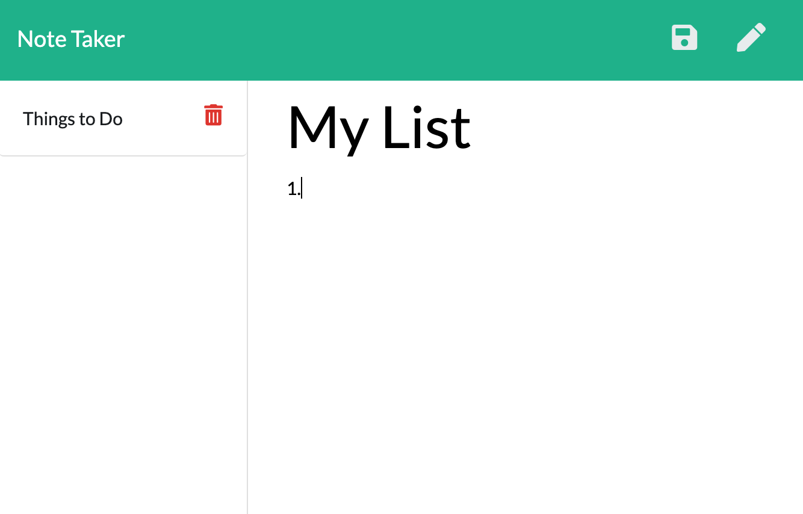

# note-taker
## Description
Using the starter code provided, this app allows the user to write and save notes. The notes are stored remotely so they be accessed from any device.

## Table of Contents
* [Installation](https://github.com/kesiahp18/note-taker#installation)
* [Usage](https://github.com/kesiahp18/note-taker#usage)
* [Tests](https://github.com/kesiahp18/note-taker#tests)
* [Questions](https://github.com/kesiahp18/note-taker#questions)
    
## Installation 
Visit the [deployed website]()].

## Usage
Enter a title and content for your note, and then click the save button in the right corner to have your note saved. To view your notes, find and click the note you wish to view from the list on the left side. You can create a new note by clicking the pencil in the top right corner.

## Questions?
If you have any questions send an email to kesiahp18@gmail.com to have your questions answered.
Also visit my [GitHub profile](https://github.com/kesiahp18)